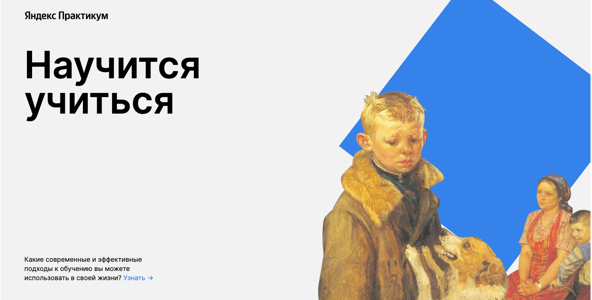

# Научиться учиться



## Проектная работа Яндекс Практикум - Статическая верстка

```
В этом проекте использованы основные технологии применяющиеся в верстке:
 1. HTML
 2. CSS
 3. БЭМ

```

### Глазков Сергей Сергеевич
